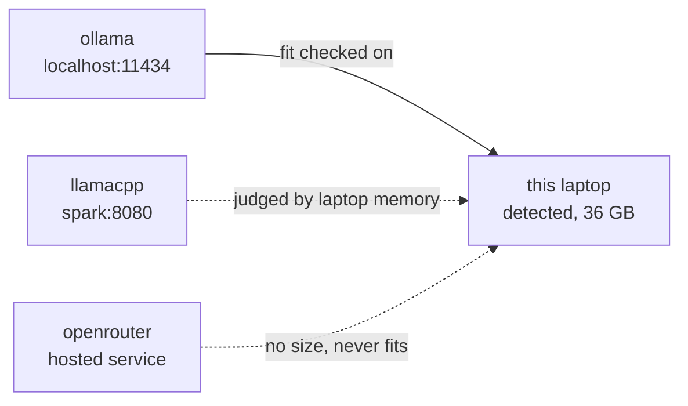
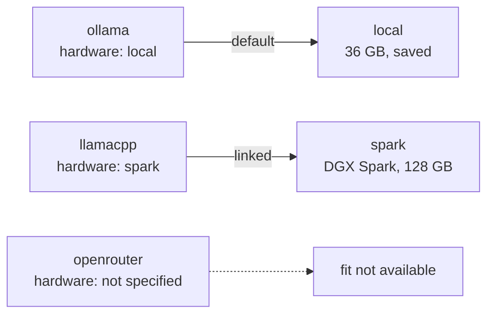
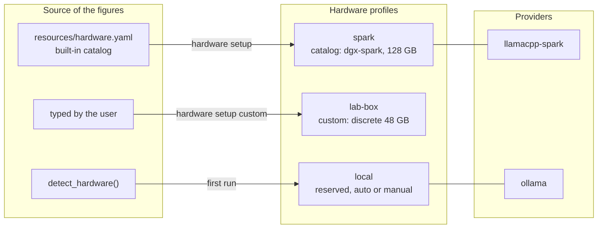
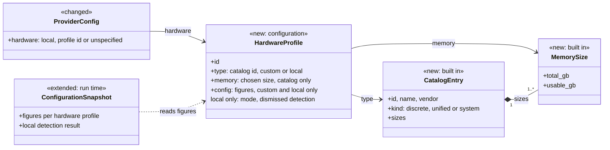
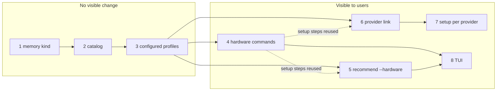

# Plan: Hardware Profiles

Issue #186.

## Overview

granite-cli estimates whether a model fits on a machine: whether its weights
and context fit in the memory available. `model recommend` uses the estimate
to list models, and `setup` uses it to choose which model to configure for
each provider.

The estimate is always made for the machine granite-cli is running on.
`detect_hardware()` reads that machine's memory, and every command uses the
result, whatever provider will serve the model.



This causes four problems.

- **Users cannot ask about other machines.** Many users serve models from a
  second machine: a DGX Spark, a workstation, a cloud GPU instance. `model
  recommend` answers only for the laptop the command was typed on.
- **Setup judges remote providers by local memory.** A provider can point at
  another machine, for example llama.cpp on a Spark. Setup still checks the
  models it picks for that provider against the laptop, so it rejects models
  the Spark could run and accepts models the Spark may not run at the
  configured context.
- **There is no defined way to describe a machine by hand.** The estimator
  reads two numbers, `vram_gb` and `ram_gb`, and nothing says what `vram_gb`
  means when the GPU shares memory with the CPU, as on Apple Silicon or the
  Spark. Two people describing the same Mac would write different numbers and
  get different recommendations.
- **Hosted models disappear without explanation.** A hosted service such as
  OpenRouter runs models on its own hardware, and its catalog variants have
  no size. The estimator treats a missing size as infinitely large, so these
  variants never fit, and setup and `model recommend` leave them out without
  saying why.

The `hardware` command and the TUI Hardware section show the detected machine
and nothing else. There is no way to list, add or remove a machine.

Two terms are used throughout:

- **Remote provider**: a provider the user runs on another machine, such as
  llama.cpp on a Spark.
- **Hosted provider**: a third-party service such as OpenRouter
  (`ProviderType::Hosted`), whose hardware the user does not know.

## Use Cases

Each use case is runnable once the sub-tasks below are complete.

Describing machines:

1. **Show this machine.** `granite-cli hardware` shows the local hardware
   profile and whether it is detected automatically or set by hand.
2. **Browse known devices.** `granite-cli hardware catalog` lists the built-in
   devices: DGX Spark, Apple M-series chips, NVIDIA and AMD GPUs, common cloud
   GPU instances.
3. **Add a known device.** `granite-cli hardware setup` creates a hardware
   profile from the catalog, asking for the memory size when the device is
   sold in several.
4. **Add an unlisted device.** `granite-cli hardware setup custom` creates a
   hardware profile from figures the user types in.
5. **Review and remove.** `hardware list`, `hardware info <id>` and
   `hardware remove <id>`. The local hardware profile is always listed and
   cannot be removed.
6. **Keep the local hardware profile accurate.** When detection finds
   different hardware, granite-cli asks before changing anything.

Using them:

7. **Ask what fits elsewhere.** `granite-cli model recommend --hardware spark`
   lists the models that fit the Spark. Naming a device that has no hardware
   profile yet offers to create one.
8. **Say where a provider runs.** `provider setup` links the provider to a
   hardware profile, and can create one on the way. `provider list` shows the
   link.
9. **Set up a remote provider.** With llama.cpp on the Spark linked to the
   Spark's hardware profile, `setup` picks models for it by what fits the
   Spark.
10. **Use the TUI.** The Hardware section lists hardware profiles and creates
    new ones. The Recommend section switches between them with one key.

## Proposal

A **hardware profile** describes one machine by its memory. granite-cli ships
a catalog of known devices; users create hardware profiles from the catalog,
or by typing the figures, and granite-cli keeps one for the local machine.
Each provider is linked to the hardware profile of the machine it runs on, and
fit is estimated against that hardware profile.



### Design decisions

In order of how much of the design depends on them.

1. **Fit is estimated on the local host, against the hardware profile of the
   machine that runs the model.** granite-cli does not run anything on that
   machine; it reads the provider's hardware profile and does the arithmetic
   locally. Each provider is linked to the local hardware profile by default,
   to another hardware profile, or to none ("not specified").

2. **A configured hardware profile refers to its catalog entry.** It stores the
   catalog id and the memory size the user chose. The memory figures stay in
   the catalog and are read when fit is estimated. Fit results are never
   saved: setup saves the model and variant it picked, and does not check fit
   again. So when a granite-cli release corrects a catalog figure,
   recommendations follow the correction, and existing configuration is
   unaffected.

3. **When fit cannot be estimated, granite-cli says so.** An estimate needs the
   size of the model variant and the provider's hardware profile. When either
   is missing, the model is listed with "fit not available" and is not
   recommended. Today such models are dropped silently.

4. **The local hardware profile is saved, and only the user changes it.**
   Detection fills it the first time. Later, when detection finds different
   hardware, granite-cli asks before updating it, and a user who does not
   trust detection can switch it off.

5. **Existing configuration keeps working.** A provider configured before this
   change is treated as running on the local machine, which is what happens
   today. `granite-cli hardware` with no subcommand still shows this machine.

### What a hardware profile contains

A hardware profile states a memory kind and a memory figure. The kind says
which figure the estimator uses:

```
  memory kind   example                     memory a model can use                headroom
  ───────────   ───────                     ──────────────────────                ────────
  discrete      RTX 4090, H100              the card's VRAM                       ÷ 1.5
  unified       Apple M-series, DGX Spark   the part of the shared pool the       ÷ 1.5
                                            GPU can address
  system        CPU only                    system RAM                            ÷ 2.0
```

The headroom factors are the ones the estimator applies today, and they do not
change.

For unified memory, the figure is the part of the pool the GPU can address,
which is what detection already reports. On a Spark that is the whole pool. On
Apple Silicon it is less: macOS lets the GPU use a working set below total
RAM, 51.8 GiB on a 64 GiB Mac. A catalog entry for an Apple chip stores that
working set for each memory size. Storing it keeps the catalog in agreement
with detection; the other two ways of writing down the same Mac move the
estimate by up to 10 GiB:

```
  One 64 GiB Mac, four descriptions
  ░ figure stored     █ memory the estimator treats as usable

                                0        16        32        48        64 GiB
                                ├─────────┼─────────┼─────────┼─────────┤
  detected today                ██████████████████████░░░░░░░░░░           34.6 usable
  catalog (this spec)           ██████████████████████░░░░░░░░░░           34.6 usable
  64 entered as VRAM            ███████████████████████████░░░░░░░░░░░░░   42.7 usable
  64 entered as RAM             ████████████████████░░░░░░░░░░░░░░░░░░░░   32.0 usable
```

Detection today reads these figures:

```
  machine            source                                what the number is
  ───────            ──────                                ──────────────────
  discrete NVIDIA    NVML memory_info().total              the card's VRAM
  DGX Spark (GB10)   NVML NotSupported → total RAM         the whole shared pool
  Apple Silicon      Metal recommendedMaxWorkingSetSize    the GPU's working set
  AMD on Linux       sysfs mem_info_vram_total             VRAM; on an APU, the firmware
                                                           reservation (not checked on hardware)
  Windows            DXGI DedicatedVideoMemory             dedicated memory only
  anything else      none                                  falls back to RAM ÷ 2
```

A hardware profile also carries the operating system, CPU architecture, vendor
and accelerator name, for display. A discrete profile may state system RAM.
The estimator reads none of these; system RAM is kept so that offloading layers
to the CPU can be estimated later without changing the format.

### Where hardware profiles come from

There are three kinds of hardware profile: catalog, custom and local.



**Catalog.** `resources/hardware.yaml` lists known devices and is compiled
into the binary. A device sold in several memory sizes has one entry with a
list of sizes. A hardware profile created from the catalog stores the entry id
and the chosen size, the same way a configured model stores its catalog id and
variant.

```
$ granite-cli hardware catalog
Hardware Catalog (24 entries)
ID                 NAME               MEMORY
apple-m4-max       Apple M4 Max       unified 36, 48, 64, 128 GB
dgx-spark          NVIDIA DGX Spark   unified 128 GB
nvidia-h100-80gb   NVIDIA H100 80GB   discrete 80 GB
nvidia-rtx-4090    NVIDIA RTX 4090    discrete 24 GB
...
```

```
$ granite-cli hardware setup
? Hardware type: apple-m4-max (Apple M4 Max)
? Memory: 128 GB
? Profile id: studio
✓ Hardware profile 'studio' configured
```

`hardware setup` asks for a size only when there is more than one, and takes
`--memory` in scripts. If a later release drops a size that a hardware profile
uses, granite-cli reports it when it loads the configuration.

**Custom.** For a device the catalog does not list, the user types the memory
kind and figure.

**Local.** One hardware profile, `local`, describes the machine granite-cli
runs on. It is reserved and cannot be removed. It stores its own figures, like
a custom profile, and a mode: `auto` or `manual`.

- **First run.** When no `local` profile exists, granite-cli writes the
  detected figures and prints a one-line notice. This needs no prompt, so
  `setup --auto` works on a new machine.
- **Auto mode.** granite-cli detects the hardware again on the commands that
  use fit (`model recommend`, `setup`), on the `hardware` commands, and when
  the TUI starts. Other commands, such as `launch`, do not detect: detection
  calls NVML, Metal or DXGI, and a launch should not change configuration.
- **When detection differs.** granite-cli never overwrites the saved figures
  on its own. An interactive run asks:

  ```
  ⚠ Local hardware differs from profile 'local':
      stored    unified 36 GB
      detected  unified 48 GB
  What would you like to do?
  > Update 'local' to the detected figures
    Keep the stored figures for now
    Keep the stored figures and stop detecting (manual)
  ```

  "For now" remembers the detected figures it dismissed, so the same
  difference is not asked about again; a different one is. The prompt uses
  the remediation prompt from spec 0024.

- **Non-interactive runs** keep the saved figures and print a warning. A run
  is non-interactive when there is no terminal, under `setup --auto`, and with
  `--output json` or `markdown`; with `--output json` the warning goes to
  stderr. The warning repeats on each run until the user acts, and a flag
  silences it.

  ```
  ⚠ Local hardware differs from profile 'local' (stored unified 36 GB,
    detected unified 48 GB).
    Using the stored figures. Run `granite-cli hardware setup local` to update.
  ```

- **TUI.** Detection runs once at start-up. A difference opens the same three
  choices before the first screen.
- **Manual mode.** No detection. The user types the figures, for example when
  detection reads only the first of two GPUs.
  `granite-cli hardware setup local --auto` turns detection back on and
  detects at once.

A detection that loses a GPU, for example after a driver update breaks NVML,
needs no special handling: the prompt shows the drop, and the user keeps the
saved figures.

```
$ granite-cli hardware list
Configured Hardware (3 profiles)
ID       TYPE        MEMORY            PROVIDERS        NOTES
local    local       unified 36 GB     ollama           auto-detected
spark    dgx-spark   unified 128 GB    llamacpp-spark
lab-box  custom      discrete 48 GB
```

In manual mode, NOTES reads "manual: detection off".

### Linking a provider to its hardware

Each provider stores which hardware profile it runs on. There are three
possible values, and the default depends on the provider type:

```
  link                stored as                default for                  fit is estimated against
  ────                ─────────                ───────────                  ────────────────────────
  local               hardware: local          providers the user runs,     the local hardware profile
                                               and every provider
                                               configured before this change
  a hardware profile  hardware: spark          (chosen by the user)         that hardware profile
  not specified       hardware: unspecified    hosted providers             nothing: "fit not available"
```

A hosted provider is shown as "hosted" where others show "not specified". Any
provider can be linked to a hardware profile later.

`provider setup` asks for the link. It offers the local hardware profile, the
configured ones, "not specified", and "create new profile…", which runs the
same steps as `hardware setup` and links the result. The two commands can
therefore be used in either order.

```
$ granite-cli provider setup
? Provider type: llamacpp
? Endpoint: http://spark:8080
? Hardware:
    local (this machine, unified 36 GB)
  › create new profile…
    not specified
? Hardware type: dgx-spark (NVIDIA DGX Spark)
? Profile id: spark
✓ Hardware profile 'spark' configured
✓ Provider 'llamacpp-spark' configured (hardware: spark)
```

```
$ granite-cli provider list
Configured Providers (4 providers)
ID              TYPE        ENDPOINT                HARDWARE
ollama          ollama      http://localhost:11434  local
llamacpp-spark  llamacpp    http://spark:8080       spark
vllm-lab        vllm        http://lab:8000         ⚠ not specified
openrouter      openrouter  https://openrouter.ai   hosted
```

The link is checked like the other references in the configuration (spec
0024). A provider linked to a hardware profile that no longer exists shows a
warning in lists, and commands that need its fit offer to repair the link.
`hardware remove` lists the providers that use a hardware profile before
removing it.

The setup wizard offers "create new profile…" wherever it links a provider.
Today the wizard only finds providers at their default local addresses, so
this matters once the wizard can add a provider by hand.

### How setup and recommend estimate fit

**Setup** considers each candidate model variant once for every provider that
can run it, against that provider's hardware profile, and keeps the best fit.
The `min_context_length` in a recommended configuration (spec 0025) is checked
against the context that fits on that hardware.

```
  model variant         provider                       hardware profile             fit
  ─────────────         ────────                       ────────────────             ───
  granite-4.2-30b       ollama      localhost:11434    local    (36 GB)             Partial (32K)
    GGUF Q4_K_M         llamacpp    spark:8080         spark    (unified 128 GB)    Full
                        vllm-lab    lab:8000           not specified                fit not available
                        openrouter  hosted             not specified (hosted)       fit not available
```

A variant with no fit available is listed and is not selected automatically.
`setup --auto` prints it with a note to choose it by hand. If every provider
is linked to the local hardware profile, which is the default, setup estimates
fit for this machine, as it does today.

**`model recommend`** estimates fit for one hardware profile, given with
`--hardware` and `local` by default. The PROVIDERS column lists the providers
linked to that hardware profile.

```
$ granite-cli model recommend --hardware spark
Recommended Models for hardware 'spark' (12 models)
ID               SIZE  VARIANT                TYPE  FIT   PROVIDERS
granite-4.2-30b  30B   GGUF / Q8_0 (32.1 GB)  Text  Full  llamacpp-spark
...
```

Models with no fit available are listed with the reason:

```
ID               SIZE  VARIANT        TYPE  FIT
granite-4.2-30b  30B   GGUF / Q4_K_M  Text  fit not available: no hardware
                                                profile for 'vllm-lab'
granite-4.2-8b   8B    OpenRouter     Text  fit not available: no size
                                                (hosted)
```

When `--hardware` names a hardware profile that does not exist, an
interactive run offers to create it, from the catalog entry with that id or as
a custom profile. This answers "would a Spark be enough?" before buying one.

```
$ granite-cli model recommend --hardware dgx-spark
? No hardware profile 'dgx-spark'. Create one from catalog entry 'dgx-spark' (NVIDIA DGX Spark)?
> Yes
  No
? Profile id: dgx-spark
✓ Hardware profile 'dgx-spark' configured
Recommended Models for hardware 'dgx-spark' (12 models)
ID               SIZE  VARIANT                TYPE  FIT   PROVIDERS
granite-4.2-30b  30B   GGUF / Q8_0 (32.1 GB)  Text  Full  none linked
```

A non-interactive run stops with an error instead:

```
Error: no hardware profile 'dgx-spark'. Configured: local, spark.
  Create it with `granite-cli hardware setup dgx-spark`.
```

### Commands

`hardware` becomes a command group, with `catalog`, `list`, `info`, `setup`
and `remove`. It takes `--output` like the other groups. With no subcommand it
shows the local hardware profile and its mode, as `granite-cli hardware` shows
this machine today.

`setup` takes a catalog id, `custom` or `local`. `setup local` takes `--auto`
or `--manual`.

### TUI

The Hardware section becomes a list of hardware profiles, with the catalog and
configured views the other sections have. `Enter` on a catalog row opens the
setup pane.

The Recommend section shows one hardware profile at a time and names it in the
title. `h` moves to the next configured hardware profile. Each profile's rows
are computed the first time it is shown and then cached, as the local rows are
today.

```
┌ Sections ─────┐┌ Hardware [configured] ───────────────┐
│ Models        ││ ID       TYPE        MEMORY          │
│ Providers     ││ local    local       unified 36 GB   │
│ Launchers     ││ spark    dgx-spark   unified 128 GB  │
│ Capabilities  ││ lab-box  custom      discrete 48 GB  │
│ Recommend     │└──────────────────────────────────────┘
│ Sessions      │┌ Recommend · spark [h: next profile] ─┐
│ Hardware (3)  ││ granite-4.2-30b  30B  Q8_0  Full     │
└───────────────┘└──────────────────────────────────────┘
```

### Data model



Solid arrows are references stored in configuration or in the catalog. The
dashed arrow is a read at run time.

The catalog is plain data: `build.rs` embeds `resources/hardware.yaml` and
checks that it parses, and the binary parses it once, as it does for
recommended configurations. A configured hardware profile has the same shape
as a configured model: an id, a type, a selector (`memory`, where a model has
`variant`) and a `config` blob, which holds the figures for custom and local
profiles and the mode for `local`.

At run time, the figures for each hardware profile are read when first needed
and kept in the configuration snapshot that `AppContext` holds (spec 0026).
Detection of the local machine runs at most once per snapshot. A
configuration write discards the snapshot, as it does for providers, models
and capabilities. Hardware profiles need no source of their own in the spec
0026 sense: there is no object to construct, only figures to look up.

Three commands read fit, and each keeps its copy of the figures for as long
as it runs:

```
  reader             copy of the figures kept for
  ──────             ────────────────────────────
  model recommend    the command
  setup              the run; the wizard's own writes discard it
  TUI Recommend      until the next configuration write
```

Launch, validation, capabilities and launchers never read fit.

## Open Questions

1. **Apple working-set figures.** The catalog stores the GPU working set for
   each Apple memory size, and it has been measured for 64 GiB only (81% of
   RAM). Should the other sizes come from measurements contributed per
   machine, or from that ratio? Separately, the estimator divides the working
   set by 1.5, although macOS has already held memory back. Is that second
   reduction intended? Answering needs real runs.
2. **Name of the flag that silences the local-hardware warning.**

## Out of Scope

- Connecting to, probing or logging in to remote machines, including
  detecting their hardware.
- Finding providers on remote machines during setup.
- Estimating speed or throughput.
- Limiting model formats by hardware profile. LM Studio decides whether it
  can run MLX from the operating system granite-cli was built for
  (`cfg!(target_os = "macos")`). A Linux laptop using LM Studio on a Mac is
  never offered MLX models, and a Mac using LM Studio on Linux can be offered
  MLX models that fail to load. With hardware profiles in place the fix is
  small: `can_run_model` reads the provider's hardware profile. It changes the
  provider interface and every implementation, and is tracked as a follow-up.
- Estimating how a model splits across several GPUs. A hardware profile states
  their total memory.
- Changing the estimator's formula or headroom factors.
- Generating the catalog from an external source.
- Typing a hardware profile id into the TUI Recommend section. New hardware
  profiles are created from the Hardware section.

## Considered Alternatives

**Store total memory for unified hardware, and convert it in the estimator.**
The catalog would hold the memory a device is sold with, the number on the
spec sheet: 64 GB for a 64 GB Mac. The estimator would then need a factor per
vendor to get from total memory to what the GPU can address, about 0.81 for
Apple at 64 GiB and 1.0 for the Spark. Without the factor, the catalog says
42.7 GiB usable where detection says 34.6 GiB, and a model that needs an
amount in between fits by one and not by the other. With the factor, the
estimator changes and vendor knowledge moves from the catalog into code. This
spec stores the GPU-addressable figure, which leaves the estimator alone and
keeps catalog and detection in agreement; the cost is one measured figure per
memory size.

**A factory registry for the catalog.** The issue suggests that hardware work
like the model registry. That registry generates one Rust type per catalog
model and picks between them with a factory, because each model is a
`dyn Model` whose methods capabilities and providers call. Hardware entries
differ only in their figures and have no behaviour, so a generated type per
entry would repeat the same few lines, and configured hardware profiles would
go through the construction machinery of spec 0026 with nothing to construct.
A factory becomes useful if hardware types gain behaviour of their own, such
as an estimator rule per memory kind or format support per vendor. A
configured hardware profile has the same stored shape as a configured model,
so that change would not change the configuration format.

**`model recommend --hardware all`.** One table with a FIT column per hardware
profile would show where each model fits. But each row shows a model's
best-fitting variant, and the best variant depends on the hardware: on the
laptop granite-4.2-30b fits best at Q4_K_M with partial context, on the Spark
at Q8_0 with full context. Each cell would need its own variant and fit, and
the table grows by two columns per hardware profile:

```
┌ Recommend · all profiles ──────────────────────────────────────────────────┐
│ ID               SIZE  TYPE  LOCAL (36 GB)     SPARK (128 GB)   LAB (48 GB)│
│ granite-4.2-30b  30B   Text  ⚠ 32K  Q4_K_M     Full  Q8_0       Full Q4_K_M│
│ granite-4.2-8b   8B    Text  Full   Q8_0       Full  Q8_0       Full Q8_0  │
└────────────────────────────────────────────────────────────────────────────┘
```

Deferred. It can be added later as another value of `--hardware` and another
stop in the TUI.

**Require a subcommand for `hardware`.** The other command groups require one:
`granite-cli model` alone prints usage. Doing the same here would be
consistent, with `hardware info local` replacing today's output. This spec
keeps `granite-cli hardware` working as it does today, for anyone who runs it
or has it in a script.

---

## Sub-Tasks

Each sub-task is one commit that leaves `main` working, with its tests and
documentation. Sub-tasks 1 to 3 change the data model; the only visible change
is the notice printed when the local hardware profile is first written.



Sub-tasks 5 and 6 reuse the `hardware setup` steps from 4 to create a
hardware profile on the way. Setup (7) needs the provider link from 6. The TUI
(8) needs the commands and the recommend changes, and can ship apart from 7.

---

### Sub-Task 1 — A hardware profile states its memory kind

**Intent**
Give a hardware profile a memory kind and figure, and produce the detected
profile in that form without changing any estimate.

**Expected Outcomes**

A hardware profile carries a memory kind, an accelerator memory figure and a
system memory figure, next to the fields it has today. Detection is split in
two: probes ask the operating system for raw findings, and a mapping turns
the findings into a hardware profile. The estimator reads the figure the kind
names, with today's headroom factors, so fit for the detected machine does not
change.

The test that calls real detection is deleted. Its result depends on the
machine running it, which AGENTS.md rules out, and the mapping tests check
more. The probes only wrap operating-system calls and have no unit tests.

Tests cover: the estimator giving today's results for one hardware profile of
each memory kind; and the mapping from made-up findings to a hardware profile,
one case per platform, including the Spark and Apple rules.

**Relevant Context**
- `src/utils/hardware.rs` (`HardwareProfile`, `usable_memory_gb`, detection,
  `test_hardware_profile_detects`)
- `src/models/context_fit.rs` (`estimate`)

**Status** — `[ ]` not started

---

### Sub-Task 2 — A built-in catalog of devices

**Intent**
Ship a catalog of known devices in the binary.

**Expected Outcomes**

`resources/hardware.yaml` lists devices as plain data, each with the memory
sizes it is sold in and, for unified memory, the GPU-addressable figure for
each size. `build.rs` embeds the file and fails the build if it does not
parse. The binary parses it once, on first use.

Tests cover: every entry declaring at least one size; unique ids; one entry
per memory kind giving the expected usable memory; and the 64 GB Apple entry
giving the same usable memory as a detected profile with the measured working
set.

**Relevant Context**
- `build.rs` (how `resources/recommended_configs` is embedded)
- `src/config/recommended_config.rs` (`BUILTIN_RECOMMENDED_CONFIGS`)

**Status** — `[ ]` not started

---

### Sub-Task 3 — Configured hardware profiles

**Intent**
Save the hardware profiles a user adds, save the local hardware profile, and
look up their figures at run time.

**Expected Outcomes**

The configuration gains a hardware directory, loaded and saved like the other
kinds. A catalog hardware profile saves its catalog id and size; custom and
local hardware profiles save their figures, and `local` also its mode.
Figures are looked up when first needed and kept in the configuration
snapshot. The first time `local` is needed and does not exist, it is written
from detection with a one-line notice. `local` cannot be removed.

Tests cover: a catalog hardware profile getting the catalog's figures for its
size; a size the catalog no longer offers reported on load; a custom profile
getting its own figures; `local` written on first use with a notice, and
refusing removal; and a configuration write discarding the looked-up figures.

**Relevant Context**
- `src/config/mod.rs` (`Config`, `load_dir`, `ConfigId`, the directories)
- `src/main.rs` (`AppContext`)
- `docs/specs/0026-instance-identity-and-reference-resolution.md`

**Status** — `[ ]` not started

---

### Sub-Task 4 — Hardware commands

**Intent**
Let users browse the catalog and manage hardware profiles from the CLI, and
keep the local hardware profile in step with detection.

**Expected Outcomes**

`hardware` becomes a group with `catalog`, `list`, `info`, `setup` and
`remove`, and takes `--output`. With no subcommand it shows the local
hardware profile and its mode. `setup` takes a catalog id, `custom` or
`local`, and `--memory` in scripts; `setup local` takes `--auto` or
`--manual`.

In auto mode, the commands that use fit and the `hardware` commands compare
detection with the saved local figures. A difference prompts when the run is
interactive and warns when it is not, and a flag silences the warning.

Tests cover: each subcommand's output through the test UI; `setup` with
scripted answers writing the expected hardware profile; `hardware` with no
subcommand showing `local` and its mode; each of the three prompt choices;
"for now" skipping the same difference next time but not a new one; the
non-interactive warning keeping the saved figures, on stderr with
`--output json`; and manual mode skipping detection.

**Relevant Context**
- `src/commands/hardware.rs`, `src/main.rs` (`Commands::Hardware`)
- `src/commands/model.rs` (`catalog` and `list`, as the pattern)
- `src/commands/shared/remediation.rs`

**Status** — `[ ]` not started

---

### Sub-Task 5 — Recommend for a chosen hardware profile

**Intent**
Let `model recommend` answer for a hardware profile other than the local one.

**Expected Outcomes**

`model recommend` takes `--hardware`, `local` by default, and estimates fit
against that hardware profile. The title names it and the PROVIDERS column
lists the providers linked to it. Models with no fit available are listed with
the reason. An id with no hardware profile offers to create one when the run
is interactive, from the catalog entry with that id or as a custom profile,
and is an error listing the configured ids otherwise.

Tests cover: one model fitting a large hardware profile and not a small one;
the default giving today's rows; a hosted variant listed with "fit not
available"; creating a hardware profile from a catalog id with scripted
answers; and an unknown id in a non-interactive run.

**Relevant Context**
- `src/commands/model.rs` (`recommend`, `recommend_rows`)

**Status** — `[ ]` not started

---

### Sub-Task 6 — A provider is linked to its hardware

**Intent**
Store which hardware profile each provider runs on, and keep that link valid.

**Expected Outcomes**

A provider's configuration gains a hardware link: `local`, a hardware profile
id, or "not specified". `provider setup` asks for it, with `local` as the
default for providers the user runs and "not specified" for hosted ones, and
can create a new hardware profile with the `hardware setup` steps. `provider
list` shows the link, with a warning on "not specified" and "hosted" for
hosted providers. The validation from spec 0024 checks the link, and removing
a hardware profile lists the providers that use it and offers the usual
choices.

Tests cover: a link to a missing hardware profile reported by validation;
creating and linking a hardware profile from `provider setup`; removing a
linked hardware profile listing its providers; a provider configured before
this change read as `local`; "not specified" surviving a save and load; and a
hosted provider defaulting to "not specified".

**Relevant Context**
- `src/config/mod.rs` (`ProviderConfig`)
- `src/config/validation.rs`, `src/commands/shared/remediation.rs`
- `src/commands/provider.rs`
- `src/providers/base.rs` (`ProviderType::Hosted`)

**Status** — `[ ]` not started

---

### Sub-Task 7 — Setup estimates fit per provider

**Intent**
Make setup pick models for each provider by what fits the hardware it runs on.

**Expected Outcomes**

Setup estimates each candidate variant against the hardware profile of each
provider that can run it, and keeps the best fit. `min_context_length` is
checked against the context that fits on that hardware. Variants with no fit
available are listed and not selected automatically; `setup --auto` prints
them with a note. `setup --auto` and the wizard share this logic. The wizard's
variant list names the hardware profile when it is not `local`, and the wizard
offers "create new profile…" wherever it links a provider.

Tests cover: a model rejected for a local provider and accepted for a provider
on larger hardware, with the same recommended configuration; a variant without
a size and a provider without a hardware profile each listed and not selected;
and the existing setup tests passing with every provider on `local`.

**Relevant Context**
- `src/commands/setup.rs` (`resolve_model_set`, `rank_variants_among`,
  `run_auto_with_hardware`, `select_variants`)

**Status** — `[ ]` not started

---

### Sub-Task 8 — Hardware profiles in the TUI

**Intent**
List and create hardware profiles in the TUI, and let the Recommend section
switch between them.

**Expected Outcomes**

The Hardware section lists hardware profiles with catalog and configured
views, shows the selected one in the detail pane, and opens the setup pane
from a catalog row. The Recommend section names its hardware profile in the
title, moves to the next one with `h`, and caches each one's rows. Detection
runs once at start-up, and a difference shows the three choices before the
first screen.

Tests cover: row counts in the Hardware section for each view; `h` changing
the rows when two hardware profiles differ; the per-section arrays with the
added section; and the start-up prompt shown on a difference and not
otherwise.

**Relevant Context**
- `src/utils/ui/app.rs` (`Section::Hardware`, `recommend_rows_cache`,
  `configured_only`, `active_search`)
- `src/utils/ui/setup_pane.rs`
- `docs/specs/0021-tui-catalog-list-toggle.md`

**Status** — `[ ]` not started
